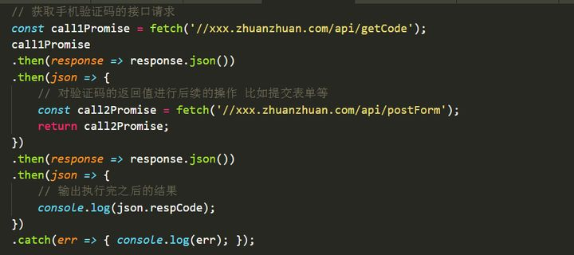

# Async和Await

1. Async：声明一个异步函数（async function someName(){...}）
   - 自动将常规函数转换为Promise，返回值也是一个Promise对象
   - 只有async函数内部的异步操作执行完，才会执行then方法指定的回调函数
   - 函数内部可以使用await

2. Await：暂停异步的功能执行（var result = await someAsyncCall();）
   - 放置在Promise调用之前，await强制其他代码等待，指导Promise完成并返回结果
   - 只能与Promise一起使用，不适用于回调
   - 只能在async函数内部使用

3. TIPS:async函数完全可以看成多个异步操作包装成的一个Promise对象，而await命令就是内部then的语法糖。

**使用场景介绍：**

1. 场景一：我们同时发出三个不互相依赖的请求，如果用async/await就显得不明智了

```js
async function getABC(){
  let A = await getValueA();
  let B = await getValueB();
  let C = await getValueC();

  return A*B*C;
}
```

如上图所示，上面我们A需要2s，B需要4s，C需要3s，我们如上图所示发请求，就存在彼此依赖的关系，c等b执行完，b等a执行完，从开始到结束需要（2+3+4）9s。

此时，需要用Promise.all()将异步调用并行执行，而不是一个接一个执行，如下所示：

```js
async function getABC(){
 let results = await Promise.all([getValueA, getValueB, getValueC])

  return results.reduce((total, value) => total * value);
}
```

2. 场景二：我曾经遇到过一个场景，一个提交表单的页面，里面有姓名、地址等巴拉巴拉的信息，其中有一项是手机验证码，我们不得不等待手机验证码接口通过，才能发出后续的请求操作，这时候接口之间就存在了彼此依赖的关系，Async跟Await就有了用武之地，让异步请求之间可以按顺序执行。

其中不用Async/Await的写法，我们不得不用.then()的方式，在第一个请求验证码的接口有返回值之后，才能执行后续的的Promise，并且还需要一个then输出结果，如下图：


而用Async/Await的方式去写就是下面这样，我们将逻辑分装在一个async函数里。这样我们就可以直接对promise使用await了，也就规避了写then回调。最后我们调用这个async函数，然后按照普通的方式使用返回的promise。

